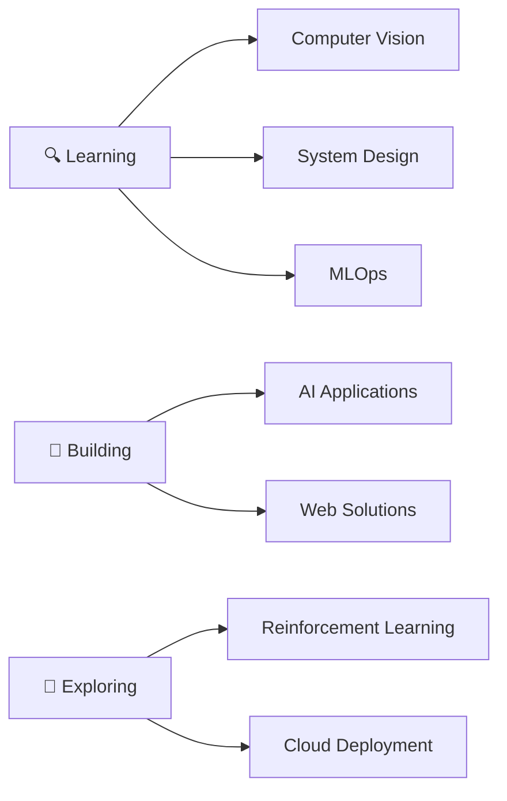

# Hi there, I'm Hardik Jain! 👋

<div align="center">
  
</div>

<div align="center">
  
[](https://linkedin.com/in/hardikjain2110)
[](https://leetcode.com/Hardik0351)
[](mailto:work.hardikjain@gmail.com)

</div>

---

## 🚀 About Me

```python
class HardikJain:
    def __init__(self):
        self.name = "Hardik Jain"
        self.role = "AI/ML Engineer & Full Stack Developer"
        self.education = "B.Tech CS @ Bennett University"
        self.cgpa = "9.22 (Dean's List Achiever)"
        self.location = "Greater Noida, India"
        
    def get_current_focus(self):
        return {
            "learning": ["Full-Stack AI Applications", "Production-Ready ML Systems", "LLM Integration"],
            "building": ["AI-powered Applications", "Web Solutions"],
            "exploring": ["Generative AI", "MLOps", "AI Agent Development"]
        }
    
    def get_life_philosophy(self):
        return "Building intelligent solutions that make a difference! 🎯"
```

---

## 🛠️ Tech Arsenal

<div align="center">

### Programming Languages


### AI/ML & Data Science


### Web Development


### Tools & Platforms


</div>

---

## 🎯 Featured Projects

<div align="center">

| 🚗 **TAGTRACK** | 😴 **NO-DOZE** | 🎓 **BOUNDLESS MINDS** |
|:---:|:---:|:---:|
| *Automatic Number Plate Detection* | *Driver Drowsiness Detection* | *Inclusive Learning Platform* |
| **85% Accuracy** | **92% Accuracy** | **100+ Users** |
| YOLO • Flask • OCR | CNN • TensorFlow • Streamlit | MERN Stack • MongoDB |

</div>

### 🔥 Project Highlights

```yaml
TAGTRACK:
  type: "Computer Vision"
  achievement: "85% accuracy across 3+ Indian plate formats"
  tech_stack: ["YOLO", "Flask", "OCR", "OpenCV"]
  features: ["Real-time detection", "Video processing", "CSV export"]

NO-DOZE:
  type: "Deep Learning"
  achievement: "92% accuracy on 2000+ facial images"
  tech_stack: ["TensorFlow", "CNN", "Streamlit"]
  features: ["30 FPS processing", "Audio alerts", "2-second response"]

BOUNDLESS_MINDS:
  type: "Full Stack Development"
  achievement: "Inclusive platform for disabled students"
  tech_stack: ["MERN", "MongoDB", "React"]
  features: ["Screen reader support", "Accessibility features"]
```


---

## 📈 What I'm Up To

<div align="center">



</div>

- 🔭 Currently working on **Full-Stack AI Applications & Production-Ready ML Systems**
- 🌱 Learning **System Design** and **MLOps**
- 👯 Looking to collaborate on **AI/ML Open Source Projects**
- 💬 Ask me about **Machine Learning, Web Development, or Problem Solving**
- ⚡ Fun fact: I can debug code faster than I can find my keys! 🔍

---

## 📫 Let's Connect!

<div align="center">

💼 **Open to opportunities in AI/ML Engineering and Full Stack Development**

🤝 **Always excited to collaborate on innovative projects!**

[](https://linkedin.com/in/hardikjain2110)
[](mailto:work.hardikjain@gmail.com)

</div>

---
